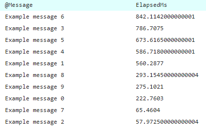

# Distancify.LitiumAddOns.Foundation

[](https://ci.appveyor.com/project/KristofferLindvall/distancify-litiumaddons-foundation)

This project contains a couple of extensions and helpers that are commonly used among all our projects using Serilog.

## How to use

### Profiling Example

This project contains a simple profiler that will include the time elapsed between log messages.

Use it like this:

```csharp
var logger = this.Log().Profile("My Profiling");
var r = new Random();

for (int i = 0; i < 10; i++)
{
    Thread.Sleep(r.Next(1000));
    logger.Information("Example message " + i);
}
```

Then, if you're using [Seq](https://getseq.net), you can simply query the elapsed timings based on your profiler name:

```
select percentile(ElapsedMs, 95) as ElapsedMs from stream where Profiler = 'My Profiling' group by @Message order by ElapsedMs desc
```

And it will show up like this:



## Publishing

The project is built on AppVeyor and set up to automatically push any release branch to NuGet.org. To create a new release, create a new branch using the following convention: `release/v<Major>.<Minor>`. AppVeyor will automatically append the build number.

## Versioning

We use [SemVer](http://semver.org/) for versioning.

## Contributing

Please read [CONTRIBUTING.md](CONTRIBUTING.md) for details on our code of conduct, and the process for submitting pull requests to us.

## Authors

See the list of [contributors](https://github.com/distancify/Distancify.LitiumAddOns.Foundation/graphs/contributors) who participated in this project.

## License

This project is licensed under the LGPL v3 License - see the [LICENSE](LICENSE) file for details